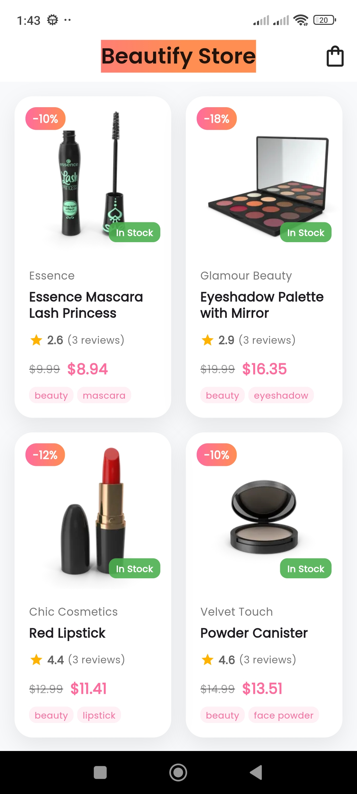

# Beautify E-commerce App

A Flutter-based mobile e-commerce application for beauty products with modern UI and smooth shopping experience.

## Key Features
- **Product Catalog**
  - Browse products by categories
  - Search functionality
  - Product filtering and sorting
  - High-quality product images with zoom

- **Shopping Experience**
  - Add/remove products from cart
  - Quantity adjustment
  - Wishlist functionality
  - Product reviews and ratings

- **Checkout Process**
  - Multiple payment options
  - Order tracking
  - Order history
  - Address management


## Technologies Used
- **Frontend**: Flutter 3.19.5 with Dart 3.3.0
- **State Management**: GetX (for reactive state management)
- **API Integration**: Dio package for REST API communication
- **Database**: sqflite for local storage
- **UI Components**: Custom widgets with Material Design 3
- **Animation**: Lottie for rich animations
- **Testing**: flutter_test for unit and widget tests

## Project Architecture
The app follows Clean Architecture with MVVM pattern:
```
lib/
├── core/               # Core functionalities
│   ├── constants/      # App constants
│   ├── utils/          # Utility classes
│   └── widgets/        # Reusable widgets
│
├── data/               # Data layer
│   ├── models/         # Data models
│   ├── repositories/   # Data repositories
│   └── services/       # API services
│
├── domain/             # Business logic
│   ├── entities/       # Business entities
│   └── usecases/       # Application use cases
│
└── presentation/       # UI layer
    ├── controllers/    # ViewModels
    ├── screens/        # Pages/Views
    └── theme/          # App theming
```

## Development Setup
1. **Clone the repository**:
```bash
git clone https://github.com/your-repo/beautify-ecommerce.git
cd beautify-ecommerce
```

2. **Install dependencies**:
```bash
flutter pub get
```

3. **Run the app**:
```bash
flutter run
```

## Building the App
```bash
flutter build apk --release  # Android
```


## Screenshots

<div align="center">
  
  
  
  
  
</div>

## License
[MIT License](LICENSE)
# Beautify

